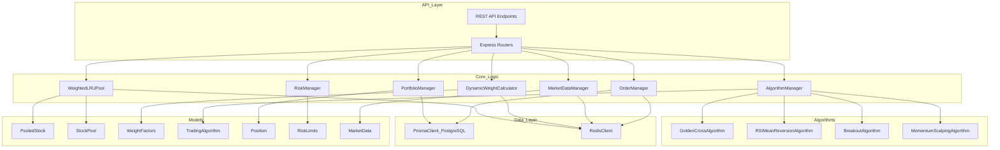
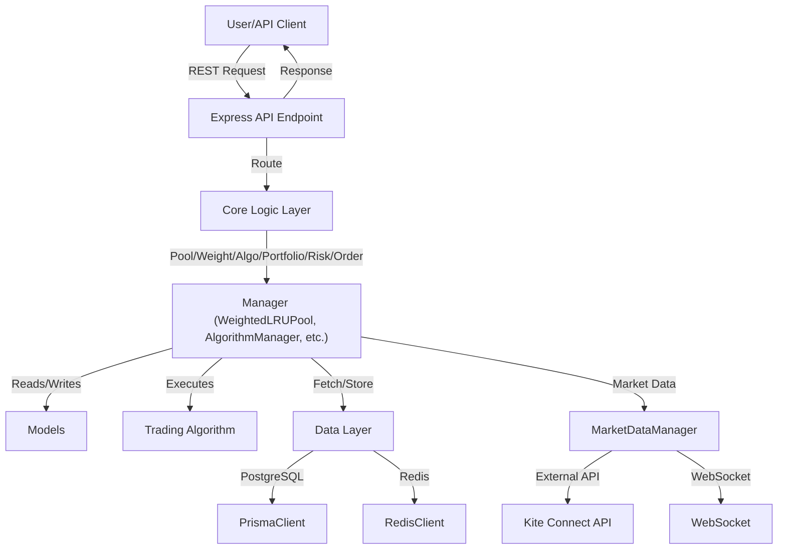

# Trading AI System

## 🚀 Project Overview
A sophisticated Trading AI System with pool-based stock management, dynamic weight calculation, and multi-strategy execution. The system uses a Weighted LRU Cache for efficient stock selection and supports real-time trading with risk controls and portfolio management.

---

## 🏗️ High-Level Design (HLD)

### Architecture Overview
- **API Layer**: RESTful endpoints using Express.js for pools, portfolio, positions, algorithms, and emergency actions.
- **Core Logic**: Manages pools, weights, algorithm assignment, portfolio, risk, orders, and market data.
- **Algorithms**: Implements strategies like Golden Cross, RSI Mean Reversion, Breakout, and Momentum Scalping.
- **Data Layer**: PostgreSQL (via Prisma) for persistence, Redis for caching.
- **Models**: TypeScript interfaces for all domain entities.

### HLD Diagram


---

## 🧩 Low-Level Design (LLD)

### Key Components
- **WeightedLRUPool**: Manages stock pools with LRU and weight-based eviction.
- **DynamicWeightCalculator**: Calculates composite weights for stocks using multiple factors.
- **AlgorithmManager**: Assigns and tracks trading algorithms per stock.
- **PortfolioManager**: Manages open positions and portfolio metrics.
- **RiskManager**: Enforces risk limits and validates trades.
- **OrderManager**: Handles order placement, tracking, and slippage.
- **MarketDataManager**: Integrates with real-time and historical market data.
- **Algorithms**: Each implements entry/exit/stop logic via a common interface.
- **Database/Cache**: Prisma for PostgreSQL, ioredis for Redis.

### LLD Details
- Each manager is a TypeScript class with clear responsibilities and interfaces.
- Models are defined as TypeScript interfaces for type safety.
- API endpoints are modular and route to the appropriate business logic.
- Algorithms are pluggable and follow a shared interface for easy extension.

---

## 🔄 Flow Diagram


---

## ⚙️ Setup & Running Instructions

1. **Install dependencies:**
   ```bash
   npm install
   ```
2. **Set up environment variables:**
   - Copy `.env.example` to `.env` or create a `.env` file with the required variables.
3. **Set up the database:**
   ```bash
   npx prisma generate
   npx prisma migrate dev
   ```
4. **Start the development server:**
   ```bash
   npm run dev
   ```
5. **Build for production:**
   ```bash
   npm run build
   ```
6. **Start the production server:**
   ```bash
   npm start
   ```

---

## 📚 Further Reading
- See code comments and each module for more details.
- Extend algorithms or managers as needed for your trading logic.
- For API documentation, see the `/src/api` folder.
